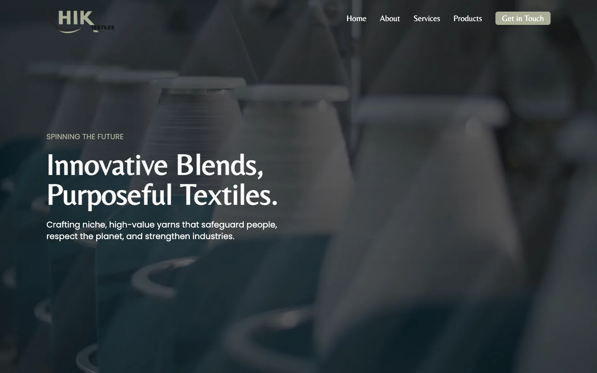
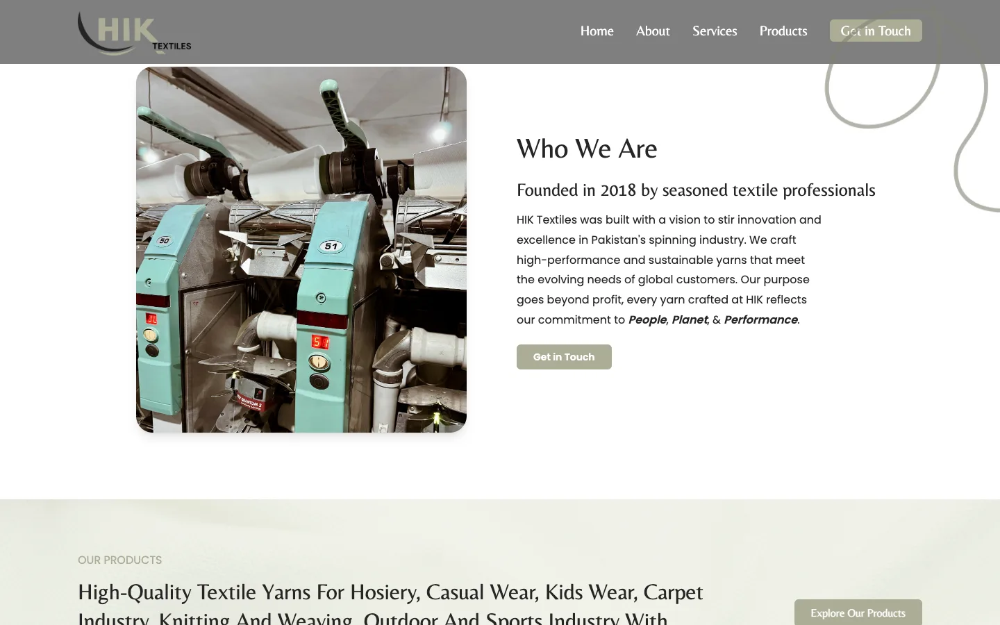
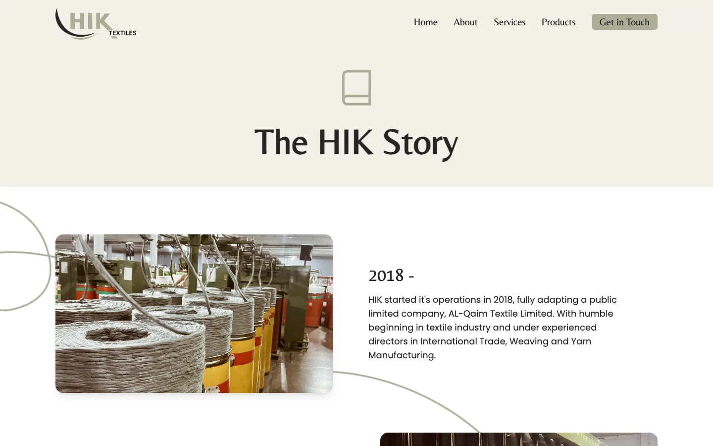
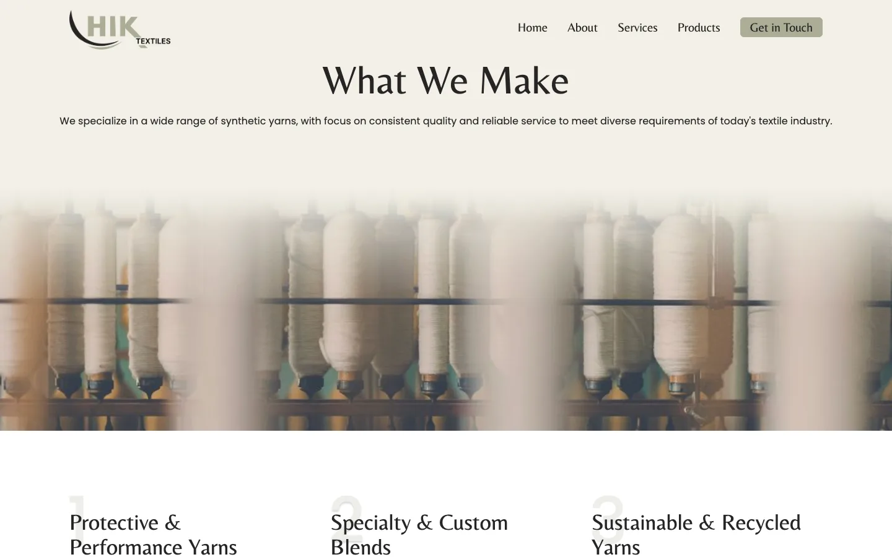
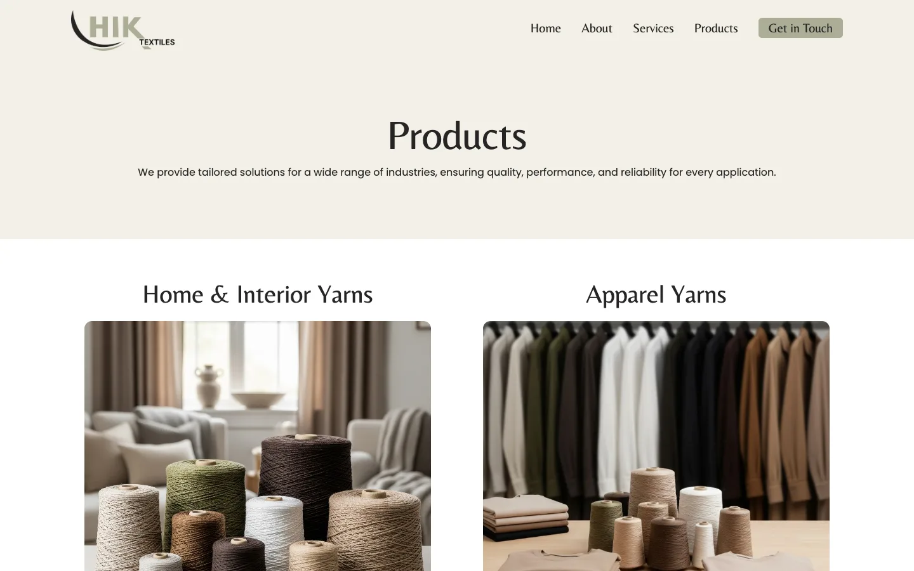
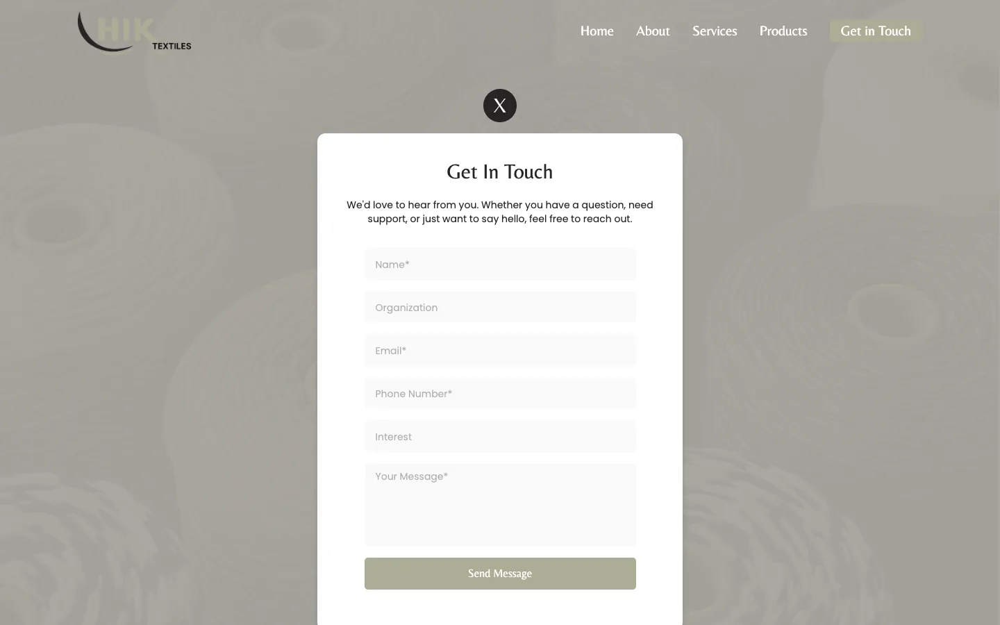
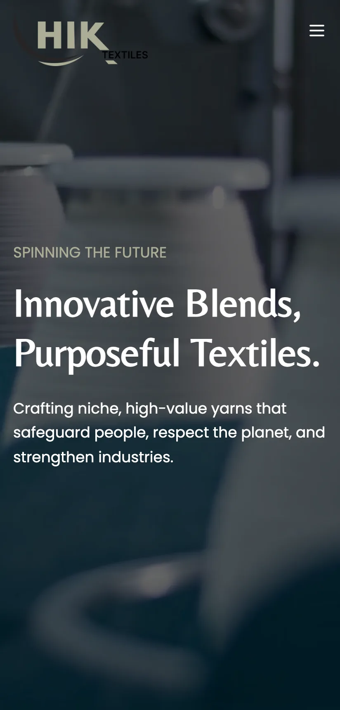
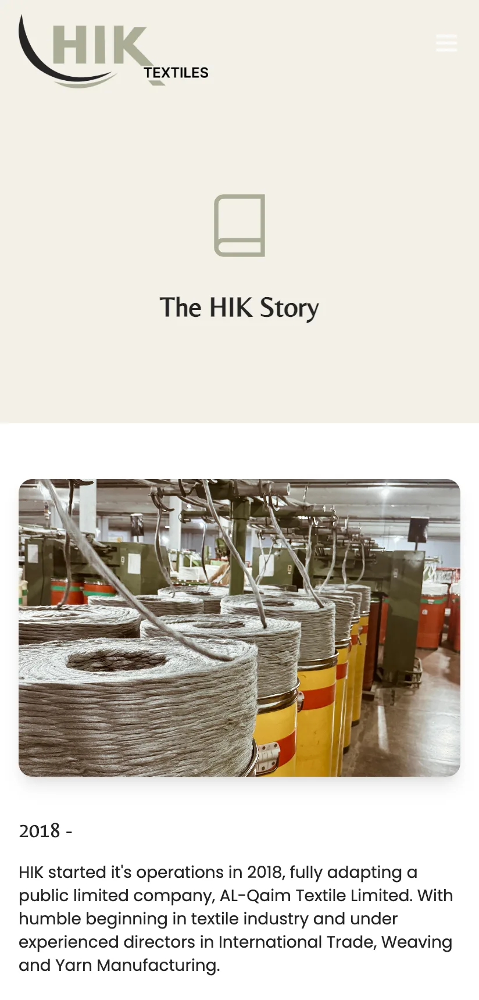
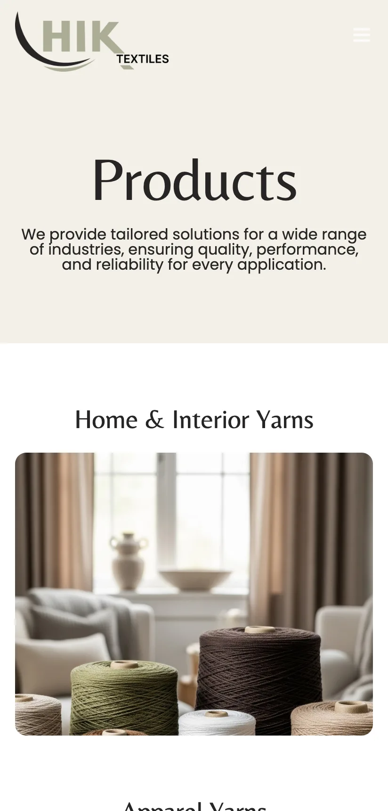
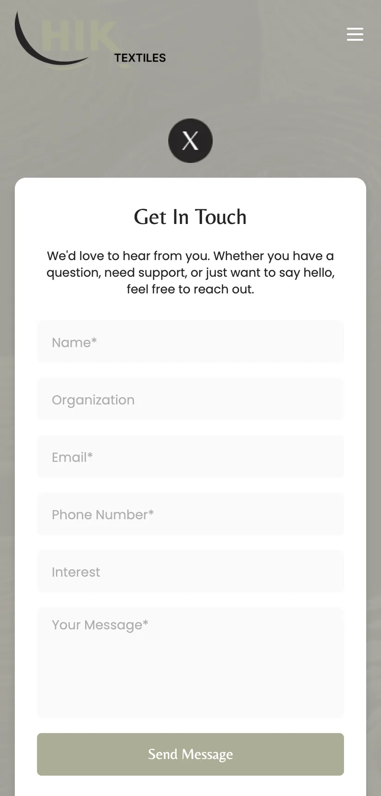

# HIK Textiles Website

**The public company website for HIK Textiles, a Pakistan-based yarn manufacturer: a five-page responsive React site with a full-screen video hero, scroll-triggered sections, product and industry pages, and a validated contact form that works without a backend.**

### [Live website: hiktextiles.com](https://hiktextiles.com/)

**Desktop · Mobile web** 
React 19 · React Router 7 · Tailwind CSS 3 · Create React App · EmailJS

<table>
  <tr>
    <td></td>
    <td></td>
  </tr>
</table>
Real captures from the live site at 1440 by 900.

---

## Product at a Glance

| | |
|---|---|
| **What it is** | A corporate website that presents a yarn manufacturer's story, product lines, services and certifications, and collects enquiries |
| **Public site** | [hiktextiles.com](https://hiktextiles.com/) |
| **Shape** | Client-side single-page app with five routes: Home, About, Services, Products, Get in Touch |
| **Audience** | Prospective textile buyers and partners, on desktop and phone |
| **Conversion goal** | A contact form for name, organisation, email, phone, area of interest and message |
| **Content** | Company story, four product lines, three service areas, five served industries, and certification badges |
| **Backend** | None of its own; the form sends through a hosted email service from the browser |

## Screenshots

<table>
  <tr>
    <td></td>
    <td></td>
  </tr>
  <tr>
    <td></td>
    <td></td>
  </tr>
</table>

### Mobile (412 by 860)

<table>
  <tr>
    <td></td>
    <td></td>
    <td></td>
    <td></td>
  </tr>
</table>

## Key Features

- **Video hero.** A muted, looping, inline-playing background video behind the headline, so it autoplays on phones and desktops without user action.
- **Scroll-triggered sections.** Home page sections (Who We Are, Products, Impact, sustainability) animate in as they enter the viewport, driven by `IntersectionObserver` rather than an animation library.
- **Animated counters.** The Impact section counts up when it becomes visible, using `react-countup`.
- **Product and industry pages.** Four product lines (Home and Interior, Apparel, Technical and Industrial, Specialty) and a Services page covering performance, custom-blend and recycled yarns plus the industries served.
- **Certifications band.** Oeko-Tex, ISO 9001:2015 and Global Recycled Standard badges on the home page, as stated by the company.
- **Contact form.** Client-side validation for required name, email format, phone and message, a submitting state, and success and error feedback.
- **Responsive navigation.** A fixed header that changes appearance on scroll and collapses to a menu button on phones.
- **Scroll reset on navigation.** Every route change returns to the top of the page.

## Architecture

The site is a static bundle. All content lives in the page components, routing is client-side, and the only network call beyond loading assets is the contact form's submission to the email service. Details: [docs/ARCHITECTURE.md](docs/ARCHITECTURE.md).

## Engineering Highlights

### Content site without a CMS or backend
- **Problem:** A manufacturer's marketing site needs to be cheap to host and quick to load, and an enquiry form still has to reach a real inbox.
- **Approach:** Static React build with copy in components, and the contact form delegated to a hosted email service called directly from the browser.
- **Outcome:** No server to run or secure. The trade-off is that content changes are code changes.

### Scroll-aware sections without an animation dependency
- **Problem:** Sections should reveal as the visitor reaches them, and slide direction should follow scroll direction.
- **Approach:** One `IntersectionObserver` per section toggles an in-view flag, and a passive scroll listener tracks direction to choose the slide side.
- **Outcome:** Reveal behaviour stays in a few dozen lines of component code. Observers are disconnected on unmount.

### Autoplay video that behaves on phones
- **Problem:** Mobile browsers block autoplay unless a video is muted and inline.
- **Approach:** The hero video is `muted`, `loop`, `autoPlay` and `playsInline`, with `preload="auto"`.
- **Outcome:** The hero plays on load across desktop and mobile browsers. The video file is large relative to the rest of the page, which is the main performance cost.

### A form with honest states
- **Problem:** Visitors should know whether their message went through.
- **Approach:** Field-level validation before sending, a disabled submitting state, success and error banners, and form reset only after a confirmed send.
- **Outcome:** Failed sends keep the visitor's text, and the send button shows a "Sending..." state while the request is in flight.

## Responsive and Accessibility Notes

- Layouts were checked at 1440 by 900 and 412 by 860.
- Images carry `alt` text in the page components; icon-only controls such as the mobile menu button use ARIA labelling.
- This portfolio does not claim a formal accessibility audit.

## Technology Stack

| Layer | Technology |
|---|---|
| UI | React 19 |
| Routing | React Router 7 |
| Styling | Tailwind CSS 3 with a custom colour and font theme; Belleza and Poppins typefaces |
| Motion | `IntersectionObserver`, CSS transitions, `react-countup` |
| Forms | EmailJS (browser SDK) |
| Tooling | Create React App (react-scripts 5) |

## Documentation

- [Product overview](docs/PRODUCT_OVERVIEW.md)
- [Architecture](docs/ARCHITECTURE.md)
- [Engineering challenges](docs/ENGINEERING_CHALLENGES.md)
- [Technical case study](docs/TECHNICAL_CASE_STUDY.md)
- [Privacy and source](docs/PRIVACY_AND_SOURCE.md)

## Source Code

Production source code is private and is not part of this repository. See [RIGHTS.md](RIGHTS.md) and [docs/PRIVACY_AND_SOURCE.md](docs/PRIVACY_AND_SOURCE.md).
