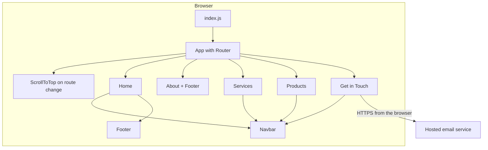

# Architecture

## Overview

A client-side React single-page application produced by Create React App. The build output is static files served by a conventional web host. There is no server code, database or API belonging to the project.

## Structure

- **Routing.** React Router with five routes. A small helper scrolls to the top whenever the path changes.
- **Pages.** One component per route; content and layout are co-located.
- **Shared components.** A navigation bar that tracks scroll position and a footer with company contact details.
- **Styling.** Tailwind CSS utilities with a custom theme (a sage-green primary colour and Belleza / Poppins fonts), plus a small amount of page-specific CSS.
- **Assets.** Photography, logos, icons, decorative line art and one hero video, served from the public folder.

## Runtime behaviour

- On Home, four `IntersectionObserver` instances flag when sections are visible, and a passive scroll listener records scroll direction for slide animations.
- The Impact section starts counters only when visible.
- The contact form validates on submit, then sends through the email service's browser SDK.

## Deployment shape

Static hosting of the production build. Because routing is client-side, the host needs a fallback to the app's entry file for deep links such as `/about`.
